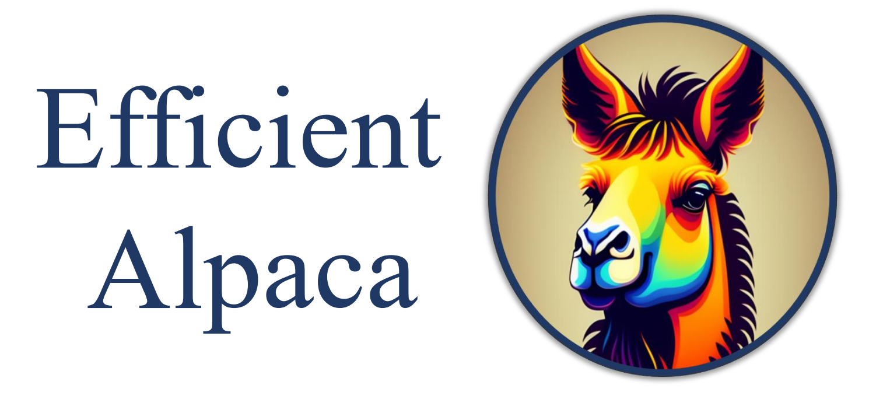
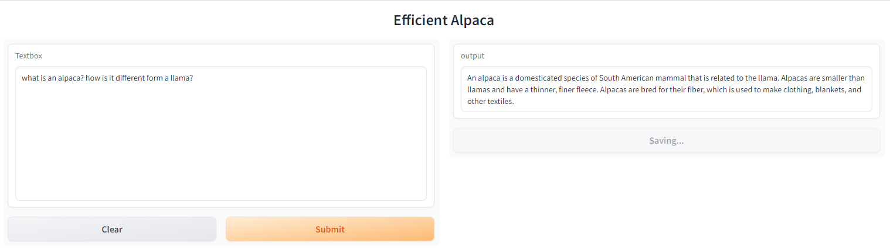

<p align="center" width="100%">

</p>

# Efficient Alpaca

The aim of this repository is to utilize LLaMA to reproduce and enhance the Stanford Alpaca, including but not limited to **reducing resource consumption**, **improving inference speed**, and more **facilitating researchers' use** (especially for fairseq users). This project will be constantly updated and maintained. Please feel free to use it!

+ Efficient Alpaca support the reproduction of Stanford Alpaca through fine-tuning LLaMA-7B on ``8 40G A100 GPUs``, in which we split the original model weight (LLaMA-7B) into 8 fragments using Megatron-LM.
+ Efficient Alpaca is capable of reproducing the Stanford Alpaca model using only the LoRA parameters, which occupy a significantly smaller space of 37M.
+ Efficient Alpaca employs a more efficient tuning approach known as LoRA, which yields faster training times, taking only 30 minutes per epoch.
+ Efficient Alpaca supports various GPU devices, including: ``1 40G A100 GPU`` or ``2 24G 3090 GPUs``.

**************************** Updates ****************************

- 3/17 We support model parallel to reduce GPU memory using Megatron-LM !
- 3/15 We released our model checkpoints !

## Web Interface:
We support [Gradio](https://gradio.app/) website interface:

```
bash  alpaca_lora/scripts/run_webapp.sh
```

<p align="center" width="100%">

</p>

## Model List
Our released models are listed as following. 
You can download it from [huggingface website](https://huggingface.co/dropreg/efficient_alpaca/).

| Model                 | Device      | Link     |
|:----------------------|:-----------:|:--------:|
| Alpaca_LoRA (epoch=3) | 1 40G A100 | [link](https://huggingface.co/dropreg/efficient_alpaca/resolve/main/alpaca_lora.pt) |
| Alpaca_MagetronLM_LoRA (epoch=3) | 2 24G 3090 | [link](https://huggingface.co/dropreg/efficient_alpaca/resolve/main/alpaca_megatron_lora.pt) |

## Setup
Ensure the pytorch and cuda environment available, and install fllowing dependences:

```
pip install fairseq
pip install fairscale
```

We have to install sentencepiece from [official repo](https://github.com/google/sentencepiece) to process data or hack for your specific task.

```
git clone https://github.com/google/sentencepiece.git 
cd sentencepiece
mkdir build
cd build
cmake ..
make -j $(nproc)
make install
```

## Prepare Model and Data:

1. Download the LLaMA checkpoint from official repo [LLaMA](https://github.com/facebookresearch/llama), or [unofficial repo](https://github.com/shawwn/llama-dl)

2. Prepare the checkpoint to fairseq toolkit:

    You process the LLaMA model based on your equipment (GPU devices). For instance, if you only have two 24G 3090 GPUs, you can choose to split the LLaMA model into two parts and select the appropriate training script.
    1. run on **single 40G A100**:
        ```
        python alpaca_lora/scripts/utils/process_llama_ckpt.py --llama-model-dir $llama_dir --llama-model-file $llama_file
        ```
    2. run on **two 24G 3090**:
        ```
        python alpaca_lora/scripts/utils/process_llama_megatron_ckpt.py --llama-model-dir $llama_dir --llama-model-file $llama_file --parallel-size 2
        ```
    after that, we can get new checkpoint file ``model.pt``.
3. Download Alpaca training file [alpaca_data.json](https://github.com/tatsu-lab/stanford_alpaca/blob/main/alpaca_data.json), which contains 52K instruction-following data for fine-tuning the Alpaca model.

4. Prepare the training data for fairseq toolkit:
    > several key parameters:
    > + **DATA** represents the path to the downloaded data
    > + **SPM** is the encoding file for SentencePiece
    > + **MODEL** is the tokenization model for LLaMA
    ```
    bash alpaca_lora/scripts/utils/prepare_llama_training_data.sh
    ```

## Fine-tunning Step:

1. Run on **8 40G A100 GPUs**: 

    To obtain 8 fragment of LLaMA-7B, we need run ``alpaca_lora/scripts/utils/process_llama_megatron_ckpt.py`` with parameter ``--parallel-size 8``.
    ```
    bash alpaca_lora/scripts/run_train_megatron_alpaca_ft.sh
    ```
## Training Step with LoRA:

We can run different manner to support device:
1. Run on **single 40G A100 GPUs**:
    > several key parameters:
    > + **data_dir** represents the processed data
    > + **save_dir** is the data path to save LoRA checkpoint
    > + **llama_dir** is the model path for processed LLaMA
    ``` 
    bash alpaca_lora/scripts/run_train_alpaca.sh
    ```

2. Run on **two 24G 3090 GPUs**:
    > several key commands:
    > + **--model-parallel-size** run model parallel by using Megatron-LM
    ``` 
    bash alpaca_lora/scripts/run_train_megatron_alpaca.sh
    ```

## Infernce Step:
We support two manner for inference:

1. (Instance-Level) Using alpaca_lora/src/inference.py line 17 to set prompts.
    ```
    bash alpaca_lora/scripts/run_inf_hub.sh
    ```

2. (Batch-Level) Please prepare the test file like [test.src](alpaca_lora/scripts/assert/test.src).

    **Note**: We have to load LoRA model for inference scripts using command ```--lora-model-inf $lora_dir```.
    1. inference on one GPUs:
        ```
        bash alpaca_lora/scripts/utils/prepare_inf_data.sh
        bash alpaca_lora/scripts/run_inf_alpaca.sh
        ```
    2. inference on two GPUs:
        ```
        bash alpaca_lora/scripts/utils/prepare_inf_data.sh
        bash alpaca_lora/scripts/run_inf_megatron_alpaca.sh
        # run 8 fragment inferece:
        bash alpaca_lora/scripts/run_inf_megatron_alpaca_ft.sh
        ```

## Some Case Sampled by Our Alpaca-LoRA:

1. **Question**: what is the capital of china?

    **Answer**: Beijing is the capital of China.

2. **Question**: please give a pieces of python code about socket connection.

    **Answer**: 
    ``` 
    import socket

    s = socket.socket(socket.AF_INET, socket.SOCK_STREAM)
    print("Constructing a socket connection")
    print(s)

    s.bind(('', 5000)) # Bind the socket to the '(' and 5000'

    print("Listening for connections")
    while True:
        connection, address = s.accept()
        print("Got connection from", address)
        print("Connected!")
        connection.close() # Close the connection.

    print("Exiting the program")
    ```

3. **Question**: 请讲一个武侠故事.

    **Answer**:
    The legendary warrior Guan Yu Once upon a time, there was a legendary warrior named Guan Yu. He was a highly skilled fighter and commander and was known for his great bravery and loyalty. He was the loyal servant of Emperor Liu Bei, and fought in the Three Kingdoms civil war alongside him. He was brave enough to challenge the powerful enemy warriors, and eventually helped Liu Bei's army defeat the Wei Kingdom, the strongest of the three kingdoms. Guan Yu was a great warrior and a hero in Chinese history.

4. **Question**: what is an alpaca? how is it different form a llama?

    **Answer**:
    Alpacas and llamas are both members of the Camelidae family. They are both herbivorous mammals that are domesticated for their coats, but they are distinctly different species. Llamas are generally larger than alpacas and have more pronounced spiral horns, while alpacas have smaller horns and more delicate coats. Alpacas also have smaller teeth and a narrower neck than llamas, and they are able to reproduced year-round. Llamas are also unable to reproduce during the winter months and have a more social behavior than alpacas.

5. **Question**: write a e-mail to congratulate Lee and mention that you are exited about meeting all of them in person.

    **Answer**:
    ```
    Dear Lee,

    I want to congratulate you on your success and I'm looking forward to meeting you and the other team members in person. 
    It's exciting to see the progress you've made and I'm sure the hard work you have put in has paid off. 
    I'm very proud of you and I'm looking forward to meeting you in person and seeing all of your progress.

    Sincerely,
    [Your Name]
    ```

5. **Question**: write a well-thought our abstract for a machine learning parper that proves that 42 is the optimal seed for training neural network.

    **Answer**:
    This paper investigates the effect of different seeds on the performance of neural networks. Through experiments, we demonstrate that the optimal seed is 42, which leads to the best performance on a wide range of tasks. We analyze the effects of different seeds on the model's accuracy, robustness, and other metrics. Our results show that 42 is the best seed for neural networks, and we discuss the implications of this finding.


## Reference

LLaMA: Open and Efficient Foundation Language Models \[[paper](https://arxiv.org/abs/2302.13971)\]\[[github](https://github.com/facebookresearch/llama)\]

```
@article{touvron2023llama,
  title={LLaMA: Open and Efficient Foundation Language Models},
  author={Touvron, Hugo and Lavril, Thibaut and Izacard, Gautier and Martinet, Xavier and Lachaux, Marie-Anne and Lacroix, Timoth{\'e}e and Rozi{\`e}re, Baptiste and Goyal, Naman and Hambro, Eric and Azhar, Faisal and Rodriguez, Aurelien and Joulin, Armand and Grave, Edouard and Lample, Guillaume},
  journal={arXiv preprint arXiv:2302.13971},
  year={2023}
}
```

Stanford Alpaca: An Instruction-following LLaMA model \[[github](https://github.com/tatsu-lab/stanford_alpaca)\]

```
@misc{alpaca,
  author = {Rohan Taori and Ishaan Gulrajani and Tianyi Zhang and Yann Dubois and Xuechen Li and Carlos Guestrin and Percy Liang and Tatsunori B. Hashimoto },
  title = {Stanford Alpaca: An Instruction-following LLaMA model},
  year = {2023},
  publisher = {GitHub},
  journal = {GitHub repository},
  howpublished = {\url{https://github.com/tatsu-lab/stanford_alpaca}},
}